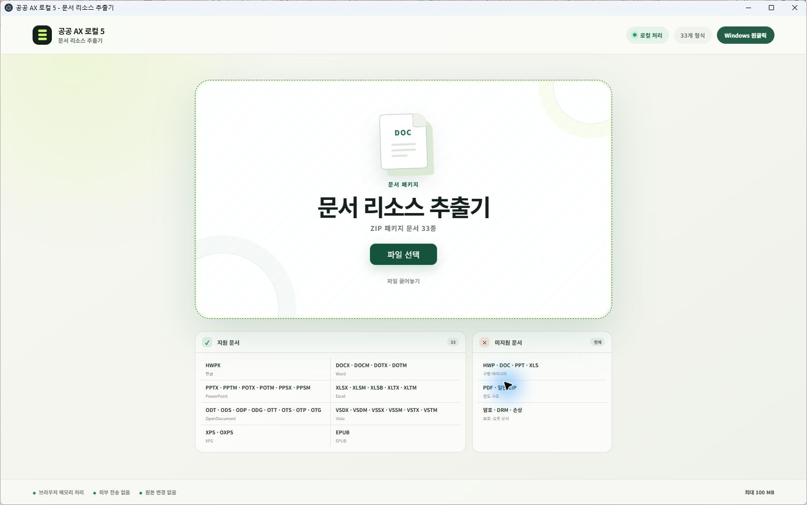
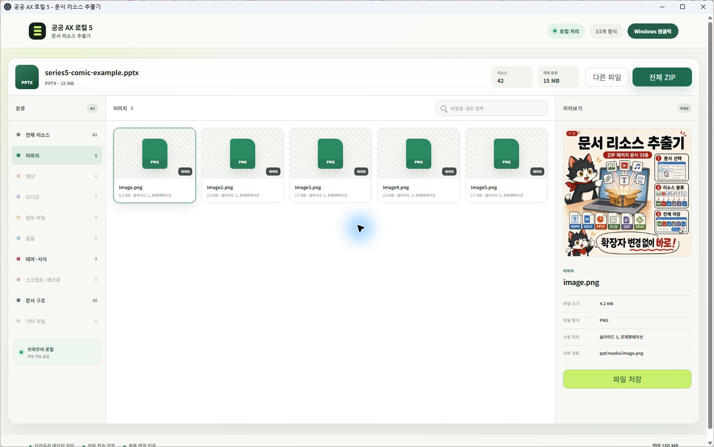

# 공공AX 로컬 시리즈 5

## 문서 리소스 추출기

HWPX·DOCX·PPTX처럼 내부가 ZIP 패키지로 구성된 문서에서 이미지, 영상,
오디오, 첨부파일, 글꼴, 서식, 스크립트·매크로, 문서 구조 파일을 찾아 분류하고
저장합니다. 문서 분석은 브라우저 메모리에서 진행되며 원본 문서를 수정하거나
외부 서버로 업로드하지 않습니다.

[Windows 릴리스](https://github.com/obundh/gonggong-ax-local-5/releases/tag/series5-v0.1.0) ·
[실행용 ZIP](https://github.com/obundh/gonggong-ax-local-5/releases/download/series5-v0.1.0/GonggongAX-Series5-Resource-Extractor-0.1.0-win-x64.zip) ·
[초보자 설명서](docs/BEGINNER_GUIDE.md) ·
[실제 화면](#실제-실행-화면) ·
[예제 PPTX](examples/series5-comic-example.pptx) ·
[만화 5장](public/series5/comic/README.md)


## 다운로드

1. [공식 `series5-v0.1.0` 릴리스](https://github.com/obundh/gonggong-ax-local-5/releases/tag/series5-v0.1.0)를 엽니다.
2. 화면 아래쪽의 `Assets`를 펼칩니다.
3. `GonggongAX-Series5-Resource-Extractor-0.1.0-win-x64.zip`을 받습니다.
4. 가능하면 같은 위치의 `.zip.sha256` 파일도 함께 받습니다.

GitHub가 자동으로 표시하는 `Source code (zip)`은 Windows 실행 패키지가
아닙니다. `시리즈5_실행.cmd`가 들어 있는 위 실행용 ZIP을 받아야 합니다.

## 원클릭 실행

1. 다운로드한 ZIP을 마우스 오른쪽 버튼으로 누릅니다.
2. `모두 압축 풀기`를 선택합니다.
3. 압축을 푼 폴더에서 `시리즈5_실행.cmd`를 더블클릭합니다.
4. 문서 리소스 추출기 창에서 `파일 선택`을 누르거나 문서를 끌어 놓습니다.
5. 원하는 리소스를 `파일 저장`으로 개별 저장하거나 `전체 ZIP`으로 한꺼번에 저장합니다.

Node.js 설치와 관리자 권한은 필요하지 않습니다. ZIP 내부에서 직접 실행하면
파일을 찾지 못할 수 있으므로 반드시 먼저 모두 압축 해제하세요.

현재 포터블 EXE는 코드 서명되지 않았습니다. SmartScreen 경고가 나오면 공식
저장소·파일명·SHA-256을 먼저 확인하세요. 확인 방법과 문제 해결 절차는
[초보자 설명서](docs/BEGINNER_GUIDE.md)에 정리되어 있습니다.

## 실제 실행 화면

공식 `series5-v0.1.0` Windows x64 실행용 ZIP을 압축 해제하고
`시리즈5_실행.cmd`로 연 전용 창입니다. 업무 문서나 개인정보가 없는
[공개 예제 PPTX](examples/series5-comic-example.pptx)를 사용했습니다.



_시작 화면 · 지원 33종 / 미지원 범위_



_PPTX 예제 · 이미지 5개 / 슬라이드 사용 위치 / 개별 저장_

예제 분석 결과는 총 42개입니다. 이미지 5개, 테마·서식 7개, 문서 구조 30개로
분류됩니다. 화면별 근거와 재현 순서는
[초보자 설명서](docs/BEGINNER_GUIDE.md#7-문서-분석)에 있습니다.

## 지원 형식

| 구분 | 확장자 |
| --- | --- |
| 한글 | HWPX |
| Word | DOCX, DOCM, DOTX, DOTM |
| PowerPoint | PPTX, PPTM, POTX, POTM, PPSX, PPSM |
| Excel | XLSX, XLSM, XLSB, XLTX, XLTM |
| OpenDocument | ODT, ODS, ODP, ODG, OTT, OTS, OTP, OTG |
| Visio | VSDX, VSDM, VSSX, VSSM, VSTX, VSTM |
| 고정 문서 | XPS, OXPS |
| 전자책 | EPUB |

총 33개 확장자를 지원합니다.

## 미지원 범위

- 구형 바이너리 문서: HWP, DOC, PPT, XLS
- PDF와 일반 ZIP
- 암호화·DRM·손상 문서
- 100 MB를 초과하는 원본 문서

확장자만 바꾼 파일은 지원 문서로 처리하지 않습니다. 확장자와 내부 패키지 구조를
함께 확인합니다.

## 처리 경계

- 문서 데이터는 브라우저 메모리에서 처리합니다.
- 원본 파일을 덮어쓰지 않습니다.
- 매크로·스크립트·실행 파일은 실행하지 않고 별도 분류합니다.
- 추출된 파일 자체의 안전성과 재사용 권한은 사용자가 확인해야 합니다.
- 큰 압축 문서는 해제 과정에서 원본 크기보다 많은 메모리를 사용할 수 있습니다.
- 내부 파일 1개 128 MiB, 전체 해제 512 MiB, 내부 항목 5,000개를 넘으면 중단합니다.
- ZIP64와 분할 ZIP 구조는 처리하지 않습니다.

## 개발

요구 환경: Windows x64, Node.js 22.13 이상

```powershell
npm install
npm run lint
npm test
```

개발 화면:

```powershell
npm run dev
```

브라우저에서 `http://localhost:3000/`을 엽니다. 이 독립 저장소의 앱 경로는
루트 `/` 하나이며 `/series2`, `/series3`, `/series5`는 제공하지 않습니다.

Windows 실행용 ZIP:

```powershell
npm run desktop:series5
npm run release:comic
```

생성 파일:

```text
release/GonggongAX-Series5-Resource-Extractor-0.1.0-win-x64.zip
release/GonggongAX-Series5-Resource-Extractor-0.1.0-win-x64.zip.sha256
release/GonggongAX-Series5-Beginner-Comic.zip
release/GonggongAX-Series5-Beginner-Comic.zip.sha256
```

빌드 스크립트는 포터블 EXE, 루트 시작 경로, 압축 해제 후 CMD 실행, ZIP 구성과
SHA-256을 검사합니다.

## 만화 자료

초보자 안내용 5장과 대체 텍스트, 재생성 프롬프트, 제작 이력, 게시용 문구는
[`public/series5/comic`](public/series5/comic/README.md)에 있습니다.

## 라이선스

프로젝트 자체 자료는 [LICENSE](LICENSE), 제3자 구성요소는
[THIRD_PARTY_NOTICES.md](THIRD_PARTY_NOTICES.md)를 따릅니다.
