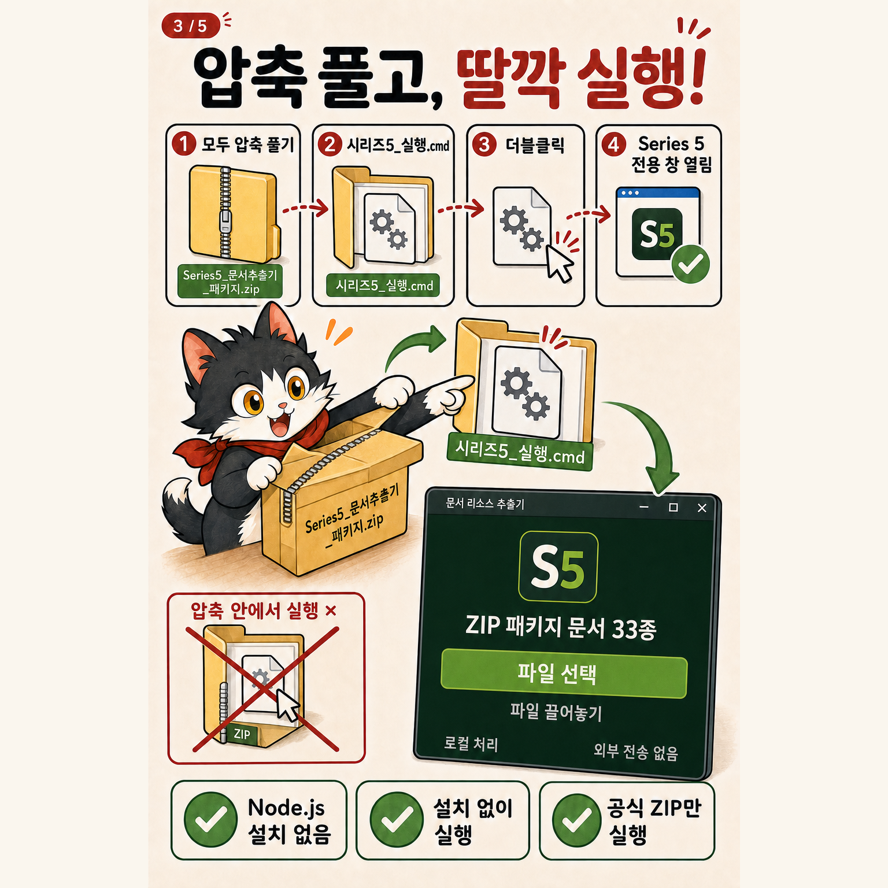
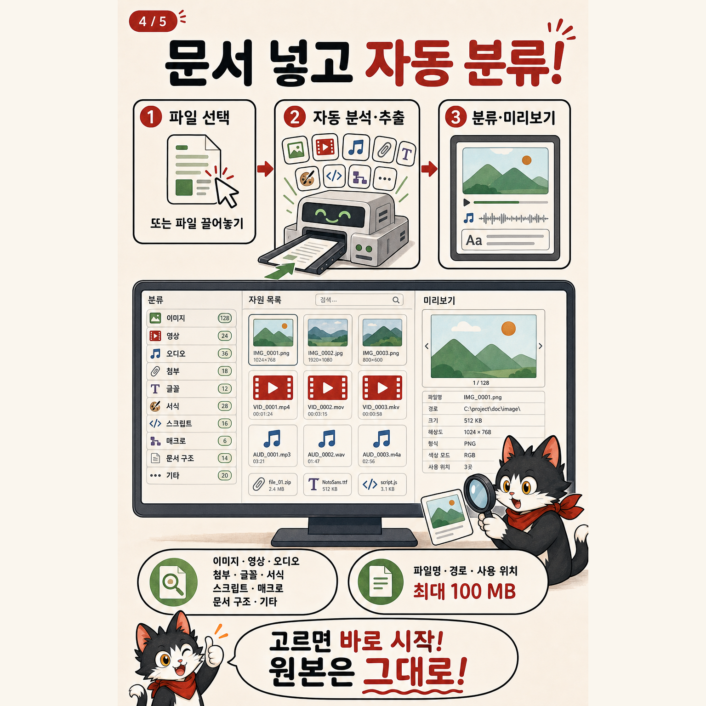

# 공공AX 로컬 시리즈 5 만화

문서 리소스 추출기의 다운로드부터 저장까지를 초보자도 순서대로 따라 할 수 있게
정리한 5장짜리 안내 만화입니다. 게시할 때는 01부터 05까지 순서를 유지하세요.

## 이미지 5장

### 1. 문서 리소스 추출기

- 파일: `series5-comic-01.png`
- 핵심: 문서 선택 → 리소스 분류 → 전체 저장
- 안내: ZIP 패키지 기반 문서 33종, 원본 확장자 변경 불필요

### 2. GitHub 다운로드

- 파일: `series5-comic-02.png`
- 핵심: `Releases` → `series5-v0.1.0` → `Assets` → 실행용 ZIP
- 주의: GitHub 자동 생성 `Source code (zip)`은 실행용 패키지가 아님

### 3. 원클릭 실행

- 파일: `series5-comic-03.png`
- 핵심: `모두 압축 풀기` → `시리즈5_실행.cmd` 더블클릭
- 안내: Node.js 설치와 설치 마법사 불필요

### 4. 자동 분류

- 파일: `series5-comic-04.png`
- 핵심: 문서 선택 또는 끌어놓기 → 자동 분석 → 분류·미리보기
- 안내: 파일명·경로·크기·사용 위치 확인, 한 파일 최대 100 MB

이미지 속 리소스 개수와 파일명은 기능을 설명하기 위한 예시이며 실제 분석 결과가
아닙니다.

### 5. 리소스 저장

- 파일: `series5-comic-05.png`
- 핵심: 카드 선택 후 개별 저장 또는 전체 ZIP 저장
- 안내: 로컬 처리, 원본 변경 없음, 매크로 실행 안 함

## 함께 쓰는 문서

- [초보자용 전체 설명서](../../../docs/BEGINNER_GUIDE.md)
- [한국어 대체텍스트](ALT_TEXT_KO.md)
- [재생성 프롬프트 사양](PROMPTS.md)
- [이미지 제작 이력](ASSET_PROVENANCE.md)
- [Threads 게시글 초안](THREADS_POST_KO.md)

## 게시 전 확인

- 다섯 장의 순서가 01 → 05인지 확인
- 본문에 공식 릴리스 링크가 있는지 확인
- `Source code (zip)`이 아니라 실행용 ZIP을 받는다고 명시
- 현재 릴리스 파일명·지원 형식·용량 제한과 만화의 안내가 같은지 확인
- 중요한 안전·제한사항은 만화만으로 생략하지 말고 전체 설명서 링크 제공

만화는 이해를 돕는 설명 이미지이며 앱 화면의 픽셀 단위 스크린샷은 아닙니다.
실제 버튼명과 최신 동작은 앱 및 초보자용 전체 설명서를 기준으로 합니다.
